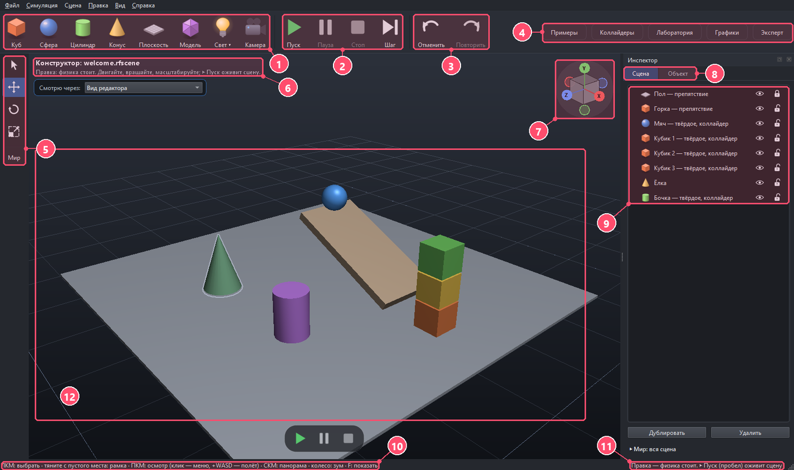
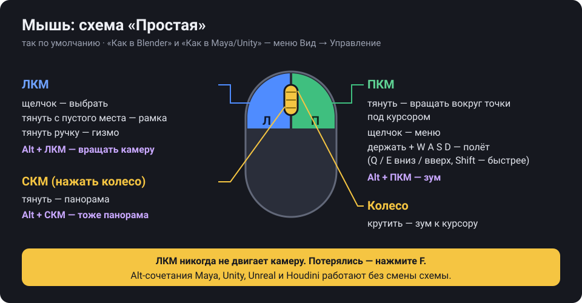
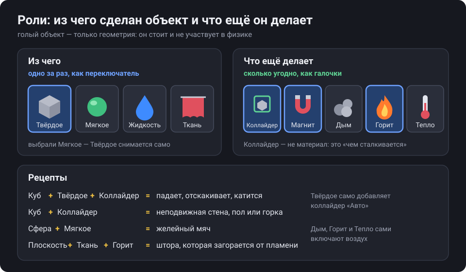
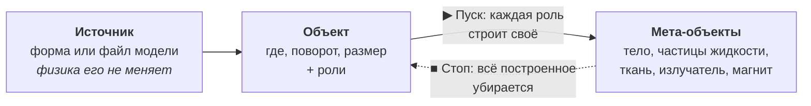
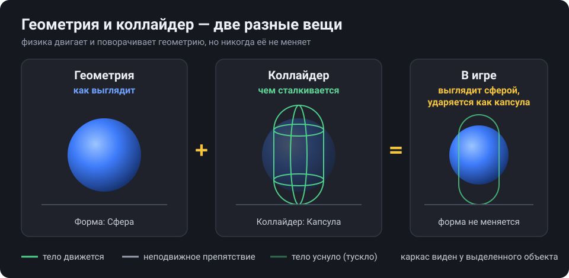
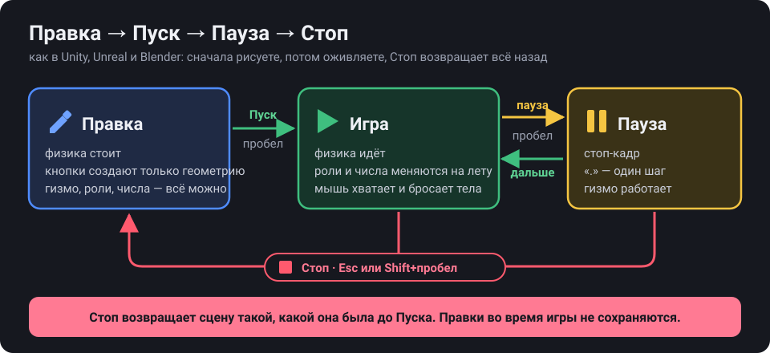
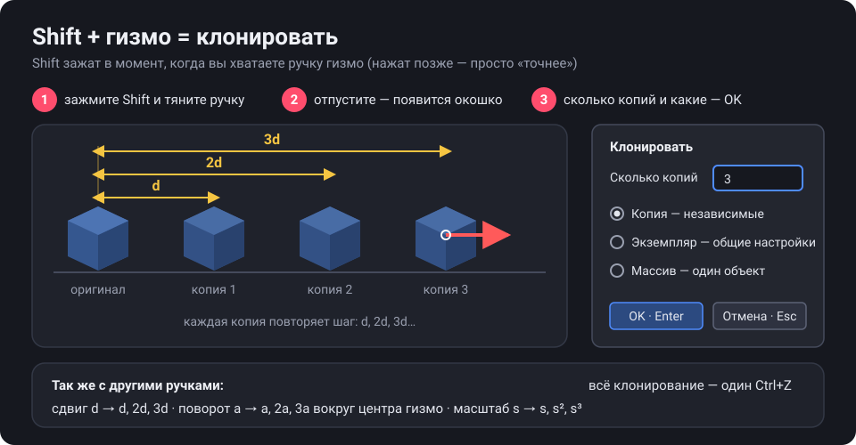
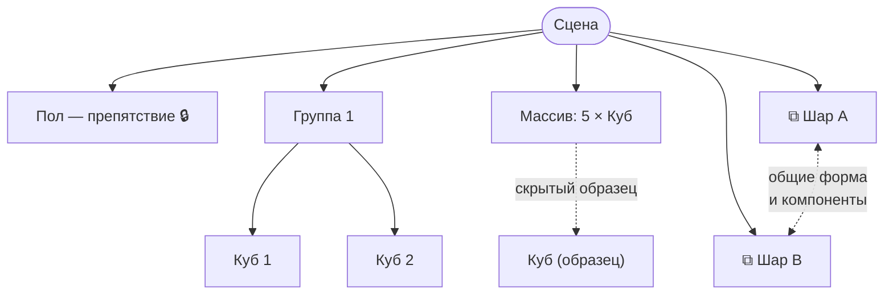
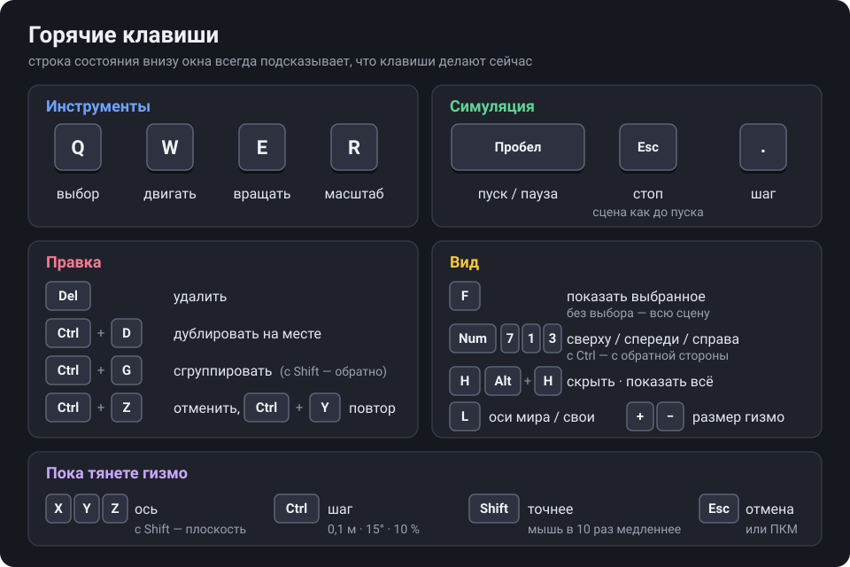

# Редактор PhysRealFlow: путеводитель по интерфейсу

Этот путеводитель объясняет окно редактора картинками: что где лежит, как двигать камеру и объекты, как оживить сцену и как вернуть всё назад. Прочитать его можно за 10 минут, а первое тело сделать уже через 30 секунд.

> [!TIP]
> Строка состояния внизу окна всегда пишет, что сейчас делают кнопки мыши и клавиши. Если забыли клавишу — посмотрите вниз.

## Содержание

1. [Тур за 30 секунд](#1-тур-за-30-секунд)
2. [Первое тело за 3 клика](#2-первое-тело-за-3-клика)
3. [Навигация: камера и куб навигации](#3-навигация-камера-и-куб-навигации)
4. [Выбор и гизмо](#4-выбор-и-гизмо)
5. [Роли и компоненты](#5-роли-и-компоненты)
6. [Геометрия и коллайдер](#6-геометрия-и-коллайдер)
7. [Правка, Пуск, Стоп](#7-правка-пуск-стоп)
8. [Много объектов сразу](#8-много-объектов-сразу)
9. [Примеры и файлы сцен](#9-примеры-и-файлы-сцен)
10. [Горячие клавиши](#10-горячие-клавиши)
11. [Если что-то не так](#11-если-что-то-не-так)
12. [Новое и скоро](#12-новое-и-скоро)

---

## 1. Тур за 30 секунд

<p align="center"></p>

| № | Что это | Зачем |
|:-:|---|---|
| 1 | **Создать**: Куб, Сфера, Цилиндр, Конус, Плоскость, Модель, Свет, Камера | кладёт в сцену новую форму, источник света или камеру. Форма — только геометрия: она ещё не падает |
| 2 | **Пуск, Пауза, Стоп, Шаг** | оживляет сцену, замораживает её, возвращает назад, делает один кадр |
| 3 | **Отменить, Повторить** | отмена любого действия, как Ctrl+Z и Ctrl+Y |
| 4 | **Примеры, Коллайдеры, Графики, Эксперт** | галерея готовых сцен; каркасы коллайдеров у всех объектов; графики снизу; все параметры решателей |
| 5 | **Инструменты**: выбор, двигать, вращать, масштаб, «Мир / Свои» | то же, что клавиши Q, W, E, R и L |
| 6 | **Заголовок вида** | имя сцены и подсказка о текущем режиме |
| 7 | **Куб навигации** | щелчок по шарику оси смотрит вдоль неё, перетаскивание вращает вид |
| 8 | **Вкладки «Сцена» и «Объект»** | список всего в сцене и свойства выбранного |
| 9 | **Список сцены** | имя и роли каждого объекта, глаз и замок |
| 10 | **Подсказки мыши** | что сейчас делают кнопки мыши и клавиши |
| 11 | **Режим** | «Правка — физика стоит» или «Симуляция идёт» |
| 12 | **3D-вид** | здесь вы выбираете, двигаете и смотрите |

На узком окне верхняя панель не обрезает слова: сначала кнопки встают плотнее (подписи остаются), затем кнопки создания оставляют только значки (подпись — во всплывающей подсказке), затем «Пуск», «Шаг» и «Отменить», затем значки становятся меньше. Кнопки «Примеры», «Коллайдеры», «Графики», «Эксперт» справа всегда остаются со словами.

Инспектор справа устроен как Hierarchy и Inspector в Unity. Щелчок по объекту открывает вкладку «Объект». Если ничего не выбрано, вкладка подсказывает, что сделать.

- **Глаз** прячет объект. Скрытое не участвует в расчёте.
- **Замок** запрещает мыши выделять и двигать объект. Так закреплён пол.

---

## 2. Первое тело за 3 клика

<p align="center"></p>

1. Нажмите **Куб** сверху. Куб появится в воздухе, на 0,8 м над полом.
2. Нажмите плитку **Твёрдое** справа. Куб станет твёрдым телом, коллайдер «Авто» добавится сам.
3. Нажмите **▶ Пуск** или пробел. Куб упадёт и отскочит.

Теперь нажмите **■ Стоп** или Esc. Куб вернётся туда, где был до пуска.

> [!NOTE]
> При самом первом запуске открывается живая сцена «Горка и башня», а жёлтый пузырь показывает эти три шага. Повторить первый запуск можно так:
> ```bat
> run.cmd --first-start
> ```

---

## 3. Навигация: камера и куб навигации

<p align="center"></p>

| Кнопка | Без клавиш | С Alt, как в Maya, Unity, Unreal, Houdini |
|---|---|---|
| **ЛКМ** | выбрать, рамка с пустого места, гизмо | вращать камеру |
| **ПКМ** | тянуть — вращать вокруг точки под курсором; щелчок — меню; держать + W A S D — полёт | зум |
| **СКМ** | панорама | панорама |
| **Колесо** | зум к курсору | — |

**Куб навигации** стоит в правом верхнем углу вида.

- Щелчок по шарику оси смотрит вдоль неё. Шарик Y — вид сверху.
- Перетаскивание куба вращает вид.
- Вся навигация доступна без клавиатуры и без цифрового блока.

**Точка вращения.** Пока камера вращается, на точке, вокруг которой она крутится, горит маленькое кольцо с жёлтой точкой — это место под курсором в момент нажатия.

**Полёт.** Держите ПКМ и нажимайте W A S D. Q и E опускают и поднимают камеру, Shift ускоряет.

**Потерялись?** Нажмите **F**. С выбранным объектом F показывает его, без выбора — всю сцену. Двойной щелчок по объекту делает то же, Home показывает всё.

**Другие схемы мыши** лежат в меню Вид → Управление. При первом запуске редактор спрашивает один раз.

| Схема | Кому | Главное отличие |
|---|---|---|
| **Простая** | по умолчанию, новичкам | камера без клавиш: ПКМ, СКМ, колесо |
| **Как в Blender** | пользователям Blender | орбита на СКМ, Shift+СКМ — панорама; G, R, S, X, Shift+D |
| **Как в Maya/Unity** | пользователям Maya, Unity, Unreal | камера только через Alt + кнопка; ПКМ — осмотр с W A S D |

> [!TIP]
> В схеме «Как в Blender» работает ввод числа: **G X 0.5 Enter** сдвигает объект ровно на полметра по X.

---

## 4. Выбор и гизмо

### Выбор

<p align="center"></p>

| Действие | Как |
|---|---|
| выбрать | ЛКМ по объекту |
| выбрать то, что позади | ещё раз ЛКМ в то же место: выбор идёт по кругу |
| добавить или убрать из выбора | Shift+ЛКМ или Ctrl+ЛКМ |
| рамка | ЛКМ-драг с пустого места; с Shift — добавить, с Ctrl — убрать |
| выбрать всё / ничего | Ctrl+A / Ctrl+Shift+A, или щелчок в пустоту |

Под курсором объект подсвечивается контуром ещё до щелчка. Видно, что будет выбрано.

### Гизмо

<p align="center"></p>

Клавиши **W**, **E** и **R** переключают гизмо. **Q** оставляет только выбор. Оси всегда окрашены одинаково: X красный, Y зелёный, Z синий. Ручка под мышью становится жёлтой.

- **Двигать (W).** Стрелка двигает по оси, цветной квадратик — в плоскости, белый кружок в центре — в плоскости экрана.
- **Вращать (E).** Кольцо вращает вокруг своей оси, внешнее белое кольцо — вокруг взгляда. Во время поворота у курсора виден угол, например «Y +60.2°».
- **Масштаб (R).** Кубик на оси масштабирует по ней, квадрат в центре — целиком.

| Пока тянете | Что будет |
|---|---|
| держать **Ctrl** | шаг: 0,1 м, 15°, 10 % |
| держать **Shift**, нажатый уже во время драга | точнее: мышь в 10 раз медленнее |
| **X**, **Y** или **Z** | только эта ось |
| **Shift+X**, **Shift+Y**, **Shift+Z** | плоскость без этой оси |
| **Esc** или ПКМ | отменить перетаскивание |

- **Оси мира или свои:** клавиша **L** или кнопка «Мир / Свои» под инструментами.
- **Двигать по полу:** Shift + перетаскивание самого объекта, не ручки.
- **Размер гизмо:** клавиши **+** и **−**. На экране гизмо не меняет размер при зуме.
- Каждое перетаскивание — один шаг отмены. Гизмо двигает сразу все выбранные объекты.

> [!IMPORTANT]
> Shift, зажатый **в момент**, когда вы хватаете ручку, не «точнее», а **клонирует**. Об этом — в разделе [Много объектов сразу](#8-много-объектов-сразу).

---

## 5. Роли и компоненты

Объект, который создала кнопка сверху, — это только геометрия. Он стоит и не участвует в физике. Физику ему дают **роли**.

<p align="center"></p>

- **Из чего** — ровно одна плитка: Твёрдое, Мягкое, Жидкость или Ткань.
- **Что ещё делает** — сколько угодно: Коллайдер, Магнит, Дым, Горит, Тепло.

### Вкладка «Объект»

<table><tr>
<td width="55%"></td>
<td>

Сверху вниз:

1. **Заголовок** — имя и значки того, что уже добавлено.
2. **Из чего** — плитки-переключатели.
3. **Что ещё делает** — плитки-галочки.
4. **Объект** — имя, глаз, замок, цвет; где, поворот, размер.
5. **Геометрия** — форма или файл модели. Физика её не меняет.
6. **Компоненты** — только добавленные. Карточка складывается, крестик её убирает.

Внизу — **«+ Добавить компонент»**.

</td>
</tr></table>

<p align="center"></p>

Меню «+ Добавить компонент» показывает только то, чего у объекта ещё нет.

| Компонент | Что это физически | Что включает сам |
|---|---|---|
| Твёрдое тело | не гнётся; падает, сталкивается, катится; плотность, трение, упругость, начальная скорость | коллайдер «Авто» |
| Коллайдер | чем объект сталкивается; один коллайдер — неподвижное препятствие | — |
| Мягкое тело | гнётся и пружинит, как желе | — |
| Жидкость | объём формы заполняется водой | — |
| Ткань | плоскость становится полотном: висит, развевается, рвётся | вешает на прут и поднимает на 1,2 м |
| Магнит | магнитный диполь: магниты притягиваются и поворачиваются друг к другу | твёрдое тело с коллайдером, если объект ни из чего не сделан |
| Излучатель (плитка «Дым») | дымный, горячий или водяной след | воздух |
| Горит | загорается от пламени и горит, ткань прогорает | воздух с кислородом |
| Тепло | горячее пятно: воздух над ним поднимается | воздух |

> [!TIP]
> Если что-то не сработает, полоса сверху инспектора скажет почему и починит одной кнопкой. Например: «Огню нужен воздух — Включить воздух».

### Как это устроено внутри

Сцена состоит из трёх слоёв. Вы правите первые два, а третий строится при пуске.



Поэтому роль можно поменять прямо во время игры. Пересобирается только этот объект, остальная сцена продолжает жить.

---

## 6. Геометрия и коллайдер

<p align="center"></p>

**Геометрия** — то, как объект выглядит. **Коллайдер** — то, чем он ударяется о другие. Сфера с коллайдером «Капсула» остаётся сферой, просто сталкивается как капсула. Так же устроено в Houdini и Unity.

<p align="center"></p>

- **Один коллайдер** — неподвижное препятствие: пол, стена, горка.
- **Твёрдое тело и коллайдер** — тело, которое падает и катится.
- Убрали коллайдер у твёрдого тела — карточка предупредит, что тело провалится сквозь всё, и даст кнопку «Добавить коллайдер».

| Вид коллайдера | Когда брать |
|---|---|
| **Авто** | почти всегда: берёт саму форму; рядом написано, во что она превратилась, например «Авто → сфера» |
| **Коробка**, **Сфера**, **Капсула** | нужна простая форма столкновений другого вида |
| **Выпуклая оболочка** | модель сложной формы, которой хватит «обёртки» |
| **Точно** | форма, разбитая на выпуклые части: для вогнутых моделей |

Галочка «Подогнать под геометрию» берёт размер из формы. Без неё размер, сдвиг и поворот задаются числами.

Коллайдер виден **тонким каркасом** поверх формы. У выделенного объекта он виден всегда, у всех — кнопкой «Коллайдеры» сверху.

| Цвет каркаса | Значит |
|---|---|
| зелёный | тело движется |
| серый | неподвижное препятствие |
| тусклый | тело уснуло |

---

## 7. Правка, Пуск, Стоп

<p align="center"></p>

- **Правка.** Так открывается редактор. Это обычный 3D-редактор: кнопки создают только геометрию, ничего не падает.
- **▶ Пуск** или пробел строит симуляцию из нарисованного.
- **⏸ Пауза** или пробел — стоп-кадр. **Шаг** или «.» считает один кадр.
- **■ Стоп**, Esc или Shift+пробел возвращает сцену такой, какой она была до пуска.
- Внизу вида всегда есть большие **▶ ⏸ ■** — те же кнопки, что наверху, под рукой.

**Игру не спутать с Правкой.** Пока сцена играет, вид обведён оранжевой рамкой, а сверху висит полоса «▶ ИГРА — правки не сохранятся после ■ Стоп» (на паузе — «⏸ ПАУЗА…»). В Правке нет ни рамки, ни полосы.

**Сохранить то, что сделала симуляция — K.** Кубики упали красиво и так должны остаться? Нажмите **K** или кнопку «Сохранить положения (K)» на полосе. Положения выбранных объектов (ничего не выбрано — всех) останутся и после ■ Стоп. Так делает Keep Simulation Changes в Unreal. После Стопа один Ctrl+Z вернёт их туда, где они были до K.

<p align="center"></p>

1. Во время игры «Пуск» серый.
2. Активны «Пауза» и «Стоп».
3. В заголовке вида идёт время симуляции.
4. Строка состояния пишет «Симуляция идёт — роли меняются на лету».
5. Вид обведён оранжевой рамкой, сверху полоса «▶ ИГРА — правки не сохранятся после ■ Стоп» с кнопкой «Сохранить положения (K)».
6. Большие ▶ ⏸ ■ внизу вида — те же кнопки, что наверху.

Во время игры инспектор живой. Включите «Мягкое» падающему кубу, и он продолжит падать желе. Мышь в игре хватает тело и тащит его.

> [!WARNING]
> Правки, сделанные во время игры, после Стопа не сохраняются, как в Unity. Хотите оставить изменение — сделайте его в Правке, а положения тел после игры сохраните клавишей **K**.

> [!NOTE]
> Некоторые правки нельзя применить на лету. Например, включение газа меняет весь мир. Тогда редактор останавливается, сохраняет правку и пишет в полосе инспектора, почему нужен ▶, с кнопкой «▶ Пуск».

---

## 8. Много объектов сразу

### Shift-клонирование

<p align="center"></p>

<p align="center"></p>

1. Зажмите **Shift** и потяните ручку гизмо. За гизмо поедет копия.
2. Отпустите мышь. У курсора появится окошко «Клонировать».
3. Выберите, сколько копий и какие, и нажмите OK или Enter.

Копии повторяют тот же шаг: d, 2d, 3d. Поворот на угол a даёт a, 2a, 3a вокруг центра гизмо, масштаб s даёт s, s², s³. Если выбрано несколько объектов, у каждого получится свой ряд. Всё клонирование отменяется одним Ctrl+Z.

<p align="center"></p>

| Вид | Что получится | Когда брать |
|---|---|---|
| **Копия** | независимые объекты; группа копируется со всем содержимым | объекты потом будут разными |
| **Экземпляр** | общие форма и компоненты: правка одного меняет все; в списке помечен ⧉ | много одинаковых вещей, которые правятся вместе |
| **Массив** | один объект «Массив»: число копий и шаг меняются одним числом | ряды, сетки, кольца |

Масштаб повторяют только копии. У экземпляров и массива размер общий, поэтому эти пункты тогда серые. Экземпляр можно отвязать кнопкой «Отвязать» в его карточке или через меню ПКМ.

### Массив

<p align="center"></p>

1. Заголовок показывает, сколько копий и какой формы.
2. **Ряд**, **Сетка** или **Круг** — узор массива.
3. **Сколько**, **Шаг**, **Поворот каждой** и **Разброс** меняют весь массив сразу.
4. **Разобрать на объекты** превращает массив в обычные объекты.

Массив получается из клонирования или через меню ПКМ → «Сделать массивом…». Оригинал становится скрытым образцом: правьте его в списке, и изменятся все копии.

### Группы

<p align="center"></p>

1. **Ctrl+G** собирает выбранное в группу, **Ctrl+Shift+G** разбирает её.
2. В списке группа раскрывается деревом.
3. Щелчок по объекту группы выбирает всю группу, и гизмо двигает её целиком.
4. Ещё один щелчок выбирает объект внутри. Строка состояния напоминает об этом.

В карточке «Группа» есть кнопка **«Склеить в одно тело»**: твёрдые части группы падают и катятся вместе, как склеенные.



### Правка сразу многих

<p align="center"></p>

1. Заголовок говорит, сколько объектов выбрано.
2. Имена разные — поле пишет «— разные имена —».
3. Значения разные — поле показывает «—». Число, введённое в такое поле, получат все.
4. Видны только карточки компонентов, которые есть у всех. Остальные поля у каждого объекта остаются своими.

Плитки ролей и «+ Добавить компонент» добавляют сразу всем выбранным.

**Выбрать похожие.** В меню ПКМ и в меню «Правка» есть три пункта:

- «Выбрать все такие же»;
- «Выбрать все с компонентом ▸»;
- «Инвертировать выбор».

---

## 9. Примеры и файлы сцен

<p align="center"></p>

Кнопка **«Примеры»** открывает галерею готовых сцен с картинками. Щелчок по картинке открывает сцену. Вкладки сверху делят сцены по темам: жидкость, аэротруба, газ и дым, твёрдые и мягкие тела, гидродинамика, огонь, плазма, уроки. Картинки редактор рисует сам, один раз, в фоне, и хранит в папке кэша.

Сцены конструктора лежат в папке `examples/`:

| Файл | Что внутри |
|---|---|
| `welcome.rfscene` | «Горка и башня»: мяч на горке, башня из кубиков, бочка, ёлка |
| `midas.rfscene` | всё сразу: магниты, дымящий ящик, штора над горелкой, желейный шар |
| `magnets.rfscene` | два неодимовых магнита в невесомости и стрелка компаса |
| `cradle-and-cubes.rfscene` | колыбель Ньютона, башня кубиков и желейный шар |

**Файлы.** Меню «Сцена» создаёт, открывает и сохраняет сцены: Ctrl+N, Ctrl+O, Ctrl+S. Формат `*.rfscene` — простой текст, по строке на факт. Его можно читать и править руками.

---

## 10. Горячие клавиши

<p align="center"></p>

| Действие | Клавиши |
|---|---|
| выбор, двигать, вращать, масштаб | Q, W, E, R |
| выбрать то, что позади | ещё раз ЛКМ в то же место |
| добавить или убрать из выбора | Shift+ЛКМ или Ctrl+ЛКМ |
| выбрать всё / ничего | Ctrl+A / Ctrl+Shift+A |
| ось; плоскость во время драга | X, Y, Z; Shift+X, Shift+Y, Shift+Z |
| шаг; точнее | держать Ctrl; держать Shift |
| отменить перетаскивание | Esc или ПКМ |
| оси мира или свои | L |
| показать выбранное или всё; всё | F или двойной щелчок; Home |
| виды сверху, спереди, справа | Numpad 7, 1, 3; с Ctrl — с обратной стороны |
| удалить; дублировать | Del или Backspace; Ctrl+D |
| сгруппировать; разгруппировать | Ctrl+G; Ctrl+Shift+G |
| скрыть; показать скрытое | H; Alt+H |
| отменить; повторить | Ctrl+Z; Ctrl+Y или Ctrl+Shift+Z |
| пуск / пауза; стоп; шаг | пробел; Esc или Shift+пробел; «.» |
| размер гизмо | + / − |
| новая, открыть, сохранить сцену | Ctrl+N, Ctrl+O, Ctrl+S |
| сохранить положения из симуляции | K (в игре и на паузе) |
| найти любую команду по имени | Ctrl+K |
| графики внизу | F9 |

Откуда эти клавиши и почему именно такие, подробно написано в [controls.md](controls.md). Правило простое: как у большинства пакетов, а где у всех по-разному — как проще.

---

## 11. Если что-то не так

| Что случилось | Что сделать |
|---|---|
| окно белое или пустое | видеодрайвер не справился с OpenGL. Редактор сам замечает одноцветный кадр и предлагает перезапуск с рендером на процессоре; выбор запоминается (Вид → Рендер на процессоре). Вручную — команда ниже |
| не помню, где команда | **Ctrl+K** и первые буквы: «груп», «коллайдер», «сохран» — Enter выполняет |
| потерялся в сцене | **F** без выделения показывает всю сцену, **Home** — тоже |
| сделал не то | **Ctrl+Z** отменяет любое действие, включая всё клонирование сразу |
| сцена «сломалась» после игры | **■ Стоп** или Esc возвращает всё как было до пуска |
| тело провалилось сквозь пол | у тела нет коллайдера: в карточке «Твёрдое тело» есть кнопка «Добавить коллайдер» |
| ничего не падает | вы в Правке: нажмите **▶ Пуск**; у объекта должна быть роль, например «Твёрдое» |
| объект не выделяется | у него закрыт замок в списке сцены |
| объект пропал | у него закрыт глаз; **Alt+H** показывает всё скрытое |
| огонь или дым не работают | полоса сверху инспектора скажет, чего не хватает, и включит воздух одной кнопкой |
| гизмо слишком маленькое или большое | клавиши **+** и **−** |

Рендер на процессоре через Mesa llvmpipe:

```bat
run.cmd --software-gl
```

---

## 12. Новое и скоро

**Найти команду — Ctrl+K.** Одна строка вверху окна: наберите часть названия, и список покажет все действия, в названии которых оно есть, с их местом в меню и клавишей. Ниже серой строки «Похожие по буквам» идут те, где только буквы стоят в том же порядке. Enter выполняет выбранное, ↑ ↓ выбирают, Esc закрывает. Так поиск заодно учит клавишам.

<p align="center"></p>

**Свет и камеры** уже есть: кнопки «Свет ▾» (Солнце, Лампа, Прожектор) и «Камера» на верхней панели, подробности — в README, раздел «Свет и камеры».

> [!NOTE]
> **Скоро в редакторе.** Эта часть ещё в работе, и в этой версии её нет.
>
> - **Панель исследования** — слои отладочной отрисовки физики: точки и нормали контактов, силы, деревья AABB, центры масс, острова, поля газа и магнитные силовые линии.
